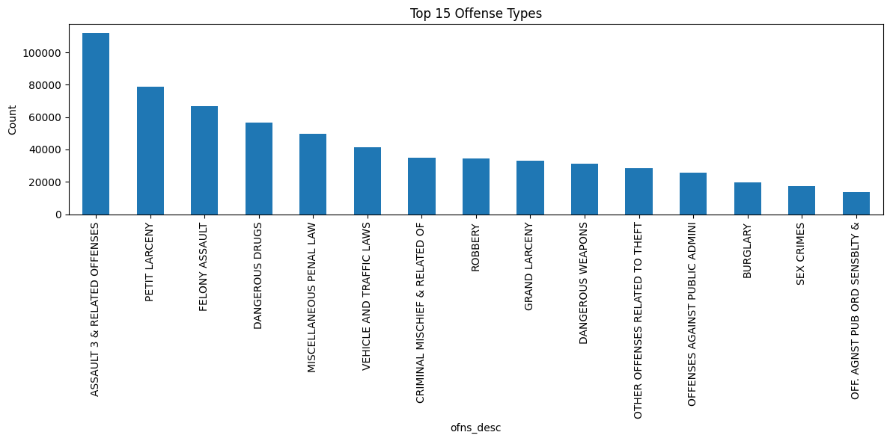
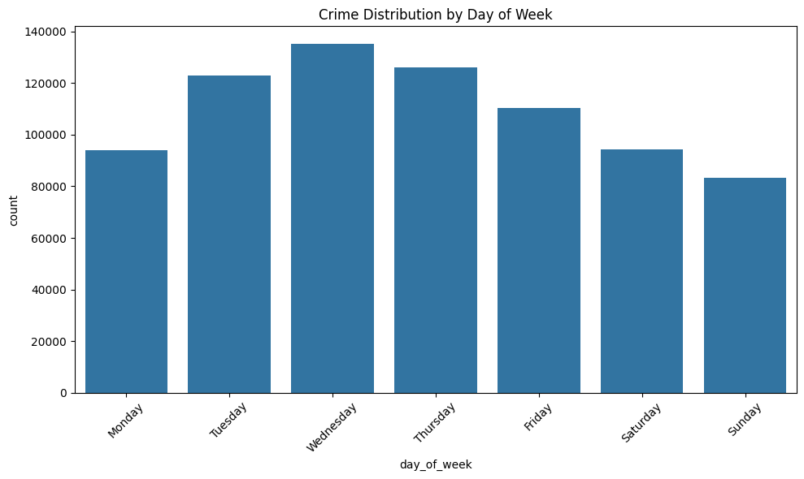
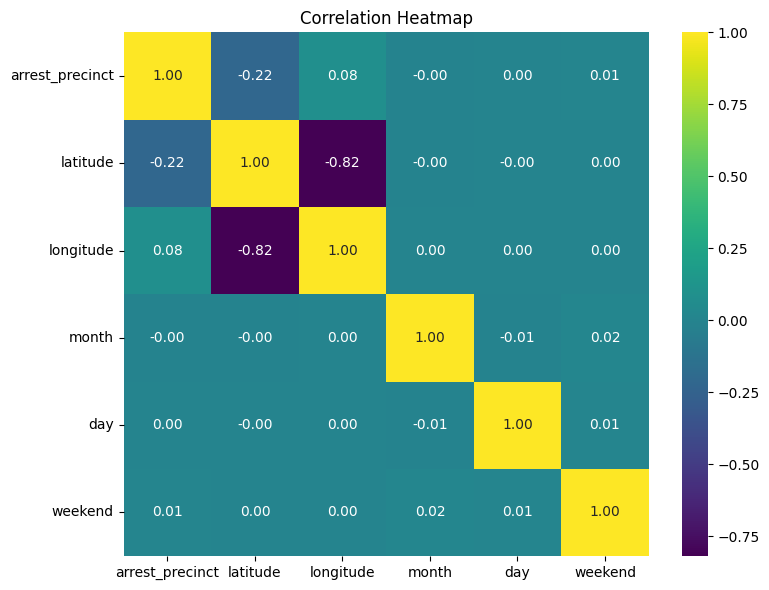
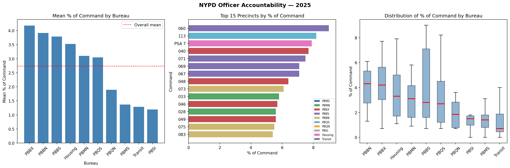
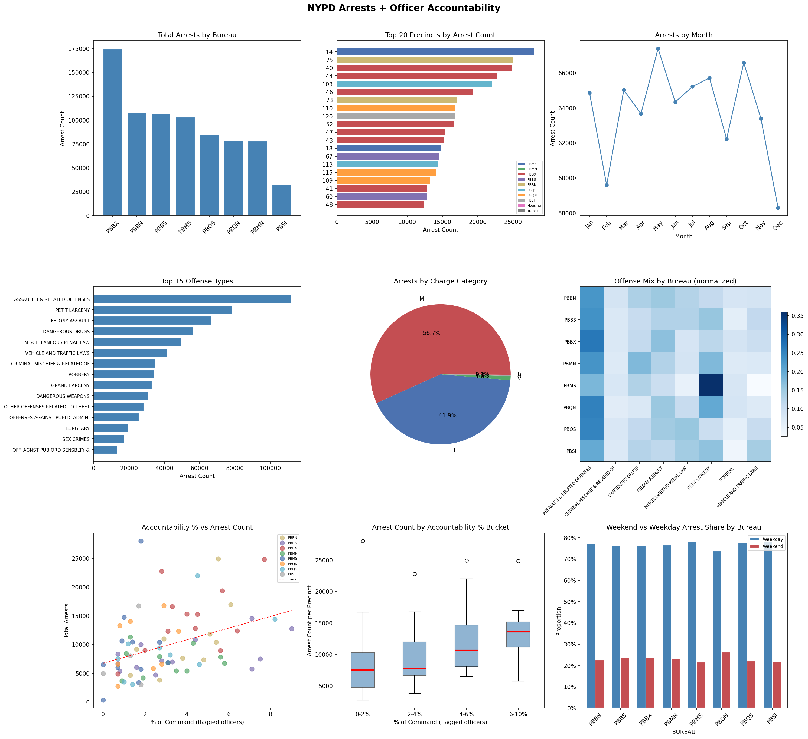

## Enhancing Public Safety: Modeling the Impact of Police Deployment on Crime Hotspots in New York City

### Team
Our team, Treeo, consists of three members:
- Ashley Rauch will act as the POC for the group - ashrauch4
- Madelyn Forster - mgforste
- Brealin Redecker - brealinredecker

### Introduction
Crime - which can lead to loss of life, physical injury, and significant economic and social impacts on individuals and communities - is inevitable. While it is impossible to completely prevent, it is the fundamental responsibility of the local government and its first responders to prioritize the safety of the public. The primary stakeholder for our project is the New York City Police Department, who are often faced with the challenge of identifying where to place its forces to protect the city and enforce the laws. Currently, police departments often rely on historical arrest data alone to decide where to send its officers, leading to circular policing. It is not uncommon to see over-policing in recent high-activity zones and under-policing in potential blind spot areas with increasing crime. 

To address this significant gap in protection, we have developed a machine learning solution that moves beyond static crime prediction to the impact of officer resource deployment on hotspots. Our project uses the NYPD Arrests Data API from the NYC Open Data platform as well as the 2025 NYPD Deployment and Accountability report. By combining the two datasets, our model uses spatial grid-cells and precinct-level deployment data to determine the unique variance explained by police presence in New York City. Moreover, by training a bias-reduced relative risk model and zeroing out the deployment data, we are able to identify which crime hotspots are structural and which are because of many officers being deployed there.

This solution addresses the stakeholder’s need to transition from reactive policing to optimized force fielding. It allows decision-makers to distinguish between areas that require consistent patrol for public safety and areas where resources can be reallocated to "explore" potential blind spots without losing coverage in known high-risk zones. This project could help in ensuring that New York City's resources are deployed based on community risk rather than historical reporting bias.

### Literature Review
The current landscape of predictive policing is dominated by algorithms designed to predict and prevent future incidents by analyzing historical data patterns (Lau). Traditionally, these methods rely on the "near-repeat victimization" theory, which says that future crimes are most likely to occur in close proximity, both spatially and temporally to previously reported incidents. However, as highlighted by recent work (Haskins; Lum & Isaac), these models are frequently too simplified because they create self-enforcing feedback loops. When police are deployed to "hotspots" based on historical arrest data, they inevitably record more arrests in those areas, which the model then interprets as a continued surge in crime. This cycle often reinforces systemic biases, particularly racial factors, as the model essentially predicts where police are likely to go rather than where new, underlying crime is truly occurring.

Our project addresses this by moving beyond simple density mapping to deployment analysis. We recognize that our primary stakeholder, like all police departments, operates under intense public scrutiny and requires a method to distinguish between crimes that occur regardless of police presence and arrests generated primarily because of officer density.

The stakeholder needs we identified for the NYPD are the following:
1. Bias-Reduced Predictions: The department needs to identify if a "hotspot" is truly a high-risk zone or if it is an artifact of high deployment. By "zeroing out" deployment data in our models, we provide a better picture of inherent risk.
2. Public Accountability: By integrating the NYPD Deployment and Accountability report, we provide transparency into how officer headcounts and precinct accountability metrics correlate with arrest volumes, which ensures that deployment strategies make sense.

### Data and Methods
#### Data
This study combines two data sources to create a multi-dimensional view of NYC public safety:

NYPD Arrest Data (2023-to-Date): From the Socrata API from NYC Open Data. This dataset represents every arrest made in New York City from 2023 to the present. It contains over 500,000 records across features such as offense description (OFNS_DESC), law category (LAW_CAT_CD), borough, and high-precision spatial coordinates (Latitude/Longitude). This data will act as our "observed" crime in NYC. While the raw API data provides the where and when, the following visualizations help define the what and how. By examining the most common offenses alongside time-based distributions and variable correlations, we can establish a baseline for how police resources are currently distributed across the five boroughs.

NYPD Deployment and Accountability Report (2025): From official NYPD PDF downloads. This dataset provides "officer-level" features, including total assigned personnel per precinct and the percentage of the command flagged for accountability review. By analyzing NYPD personnel data alongside arrest records, we can better visualize the relationship between police presence and internal accountability. The following charts break down the percentage of command review flags by bureau and precinct, providing a baseline for assessing departmental oversight across New York City.

We then merged these two data sources together on precinct value and were left with 766,327 rows and 38 columns of data to work with. 

**Merged Dataset Visuals:**

#### Methods
Our modeling approach was designed to move beyond basic crime forecasting and into deployment analysis to address the potential over-policing problem. The primary target variable is crime_count which is the number of arrests in a given grid cell on a given day. Also, for our alternative analysis, we derived hotspot indicators which grid cells with predicted crime in the top percentile (top 10%). The process involved a multi-stage pipeline:
1. Data Transformation and Spatial Engineering: The raw arrest data (point coordinates) and deployment data (precinct headcounts) were on different spatial scales. To resolve this, we:
    - Created a Geospatial Grid: We rounded coordinates to two decimal places, creating approximately 700-900 unique grid cells (roughly 500m x 500m).
    - Nearest-Precinct Mapping: Using a BallTree algorithm with a Haversine metric, we calculated the distance between every grid cell centroid and the 77 NYPD precinct stations. Each cell was then assigned the officer headcount of its nearest precinct.
    - Temporal Aggregation: We aggregated the data to a daily level, ensuring the model could learn from day-of-week and seasonal trends.
2. Target Variable Selection: We tested two targets: 
    - Target A (Base): crime_count (The raw number of arrests in a cell on a given day).
    - Target B (Relative Risk/Residuals): The difference between the log-transformed actual arrests and the 30-day rolling mean. This "Bias-Reduced" target looks at volatility when crime is higher than expected for that specific location.
3. Feature Engineering: To provide the model with context, we made:
    - Lag Features: 1-day, 7-day, and 30-day lags to capture recent trends. 
    - Deployment Metrics: estimated_officers and % of command (Accountability metrics).
    - Categorical Encodings: Label Encodings for Boroughs and Precincts.
4. Modeling Approaches:
    - Random Forest Regressor: Used for its ability to handle non-linear relationships and provide clear feature importance.
    - XGBoost Regressor: This was our best approach. We used gradient boosting to handle the zero-inflated nature of the grid cells.
    - Counterfactual Simulation: Once the best model was trained,  we re-ran the test set with estimated_officers and % of command set to zero. This allowed us to observe which "hotspots" persisted versus those that vanished. We trained two versions of each model Baseline model (no deployment features) which includes only temporal, spatial, and historical crime features and a Deployment model (with deployment features) which adds deployment-related variables to assess their incremental predictive value.

##### Hotspot Analysis
We defined crime hotspots as grid cells with predicted crime levels above the 90th percentile. Using this definition, we identified hotspots under observed deployment, recomputed hotspots under counterfactual scenarios, and measured persistence of hotspots at the grid level. This enables us to distinguish between persistent hotspots (likely driven by structural factors) and deployment-sensitive hotspots (influenced by policing levels).

##### Alternative Approaches Considered
We explored several variations of the modeling approach. One of which was a simple model without lag features which performed poorly. This told us that temporal dependence is important for prediction. We also looked at raw deployment variables only which had limited explanatory power, leading us to introduce normalized deployment intensity measures. Furthermore, we looked at label encoding for categorical variables but this introduced unintended ordinal relationships, however we ultimately used label encoding to maintain computational efficiency and avoid excessive feature expansion. Our final approach reflects a balance between predictive performance and interpretability, while enabling meaningful counterfactual analysis.

### Supporting Files
The supporting Jupyter notebooks are in the work/ directory.
| Notebook | Purpose |
| :--- | :--- |
| data_preprocessing.ipynb | This notebook contains our initial data cleaning and EDA when we originally were going to use a 2026 YTD Arrest csv file. |
| data_preprocessing_updated.ipynb | This notebook contains the final data cleaning and EDA when we used the API to extract the crime data. |
| modeling.ipynb | This notebook contains initial grid creation and ideas prior to having all relevant datasets. |
| modeling_use.ipynb | This notebook contains the Random Forest and XGBoost models we ran, with and without deployment. |
    
### Results
We evaluated model performance using Mean Absolute Error (MAE) and R², comparing models with and without deployment features.

Model Performance
Model	MAE	R²
Random Forest (no deployment)	1.3570	0.4994
Random Forest (with deployment)	1.3564	0.4998
XGBoost (no deployment)	1.3544	0.5054
XGBoost (with deployment)	1.3551	0.5053

Overall, XGBoost outperformed Random Forest in terms of both MAE and R². However, the inclusion of deployment features resulted in only a very small change in predictive performance, suggesting that historical crime patterns remain the dominant predictor.

We quantify the unique contribution of deployment as:

ΔR² = R² (with deployment) − R² (without deployment)

This value is extremely small, indicating that deployment explains only a limited portion of additional variance beyond historical trends.

##### Feature Importance

Feature importance analysis shows that:

Lagged crime variables (lag_1d, lag_7d, rolling_30d_mean) are the strongest predictors
Temporal features (day of week, seasonality) also contribute meaningfully
Deployment features have lower but non-zero importance, indicating a measurable but secondary effect

##### Counterfactual Results

We evaluated hotspot persistence under different deployment scenarios:
Baseline hotspots: 5,030
Hotspots under zero deployment: 4,942
Persistent hotspots: 4,916

We also computed:

Percentage of hotspots remaining under zero deployment: 97.73%

These results show that a substantial proportion of hotspots remain even when deployment is removed, suggesting that many crime patterns are structural rather than deployment-driven.

##### Bias-Reduced Model

We implemented an alternative model using a residual-based target to capture deviations from expected crime levels. This model:

- Focuses on unexpected crime relative to historical baseline
- Reduces reliance on historical crime as a dominant predictor
- Highlights the role of deployment in explaining deviations

This model achieved an MAE of 0.3125 and an R² of 0.0677, which is expected given that it removes the dominant effect of historical crime levels. Feature importance results from this model show increased relative importance of temporal and deployment-related variables, suggesting that deployment plays a more meaningful role in explaining deviations from expected crime rather than overall crime levels.

### Discussion
We achieved our goal of modeling the impact of police deployment on crime hotspots in New York City by isolating the variance uniquely explained by deployment. Our goal was to evaluate the relationship between police deployment and observed crime, and to provide a framework for more informed resource allocation. We were unable to specifically state where forces should be deployed, but by uncovering whether hotspots are structural or due to police density, we created a call to action. Our results indicate that approximately 97.73% of New York City’s crime hotspots persist even when deployment is removed. As a result, the NYPD should prioritize these persistent hotspots, where the model predicts high crime even in the absence of police presence.

Furthermore, our Relative Risk model addresses the need for adaptability. By focusing on residuals, we identified "blind spots" which are areas where crime is currently low but relative risk is spiking. This indicates that many hotspots are driven by underlying structural factors, such as environmental or socioeconomic conditions, rather than deployment alone and provides the NYPD with a tool to explore new areas rather than repeatedly exploiting historical hotspots.

Looking at it from a stakeholder perspective, simply increasing deployment in known hotspots may not substantially reduce crime, resources may be more effectively allocated by identifying emerging or under-policed areas and counterfactual analysis provides a more nuanced understanding of where intervention is most needed. Our model partially addresses the stakeholder need for actionable and transparent insights, but it should be viewed as a decision-support tool rather than a prescriptive system.

### Limitations
Despite our progress, this work has limitations:
1. Proxy for Deployment: We used "Officers Assigned to Precinct" as a proxy for "Officers in a specific grid cell." In reality, patrols move within a precinct. Without GPS-level patrol data (which is not public), our "Deployment" feature remains an estimation.
2. Reporting Bias vs. Deterrence: Our model struggles to distinguish between Detection (more police = more arrests) and Deterrence (more police = fewer crimes). If a hotspot "vanishes" when deployment is zeroed, it could be because the crime stopped happening or simply because no one was there to catch it.
3. Causal limitations: While we use counterfactual simulations, the model remains observational and cannot fully establish causal relationships.
4. Spatial approximation: grid cells are constructed using coordinate rounding, which may not perfectly align with real-world neighborhood boundaries.
5. Lack of external factors: the model does not include demographic, economic, or environmental variables that may influence crime patterns.

### Future Work
Future work could improve this model by incorporating additional external features such as socioeconomic indicators, weather data, and event-based variables. Access to real-time patrol data would significantly improve the accuracy of deployment modeling. Additionally, causal inference techniques could be applied to better isolate the true impact of police deployment on crime.

### References
“Delivering Accountability: A Plan To Stop Crime in Our Communities.” Center for American Progress, 29 Jan. 2026, www.americanprogress.org/article/delivering-accountability-a-plan-to-stop-crime-in-our-communities/. 

Haskins, Caroline, et al. “Academics Confirm Major Predictive Policing Algorithm Is Fundamentally Flawed.” VICE, 9 Aug. 2024, www.vice.com/en/article/academics-confirm-major-predictive-policing-algorithm-is-fundamentally-flawed/. 

Lau, Tim. “Predictive Policing Explained.” Brennan Center for Justice, 1 Apr. 2020, www.brennancenter.org/our-work/research-reports/predictive-policing-explained. 

Turner, David. “Los Angeles County Crime Statistics & Trends (2020–2025).” Valley Alarm, 14 Oct. 2025, www.valleyalarm.com/los-angeles-crime-statistics/. 